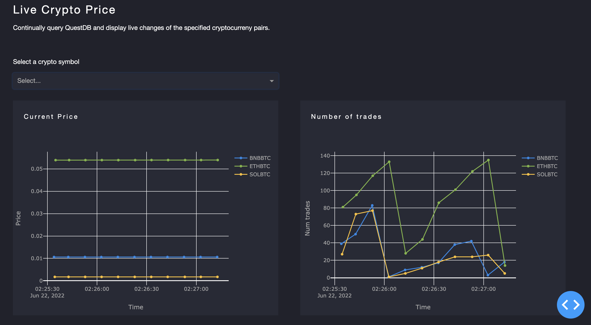
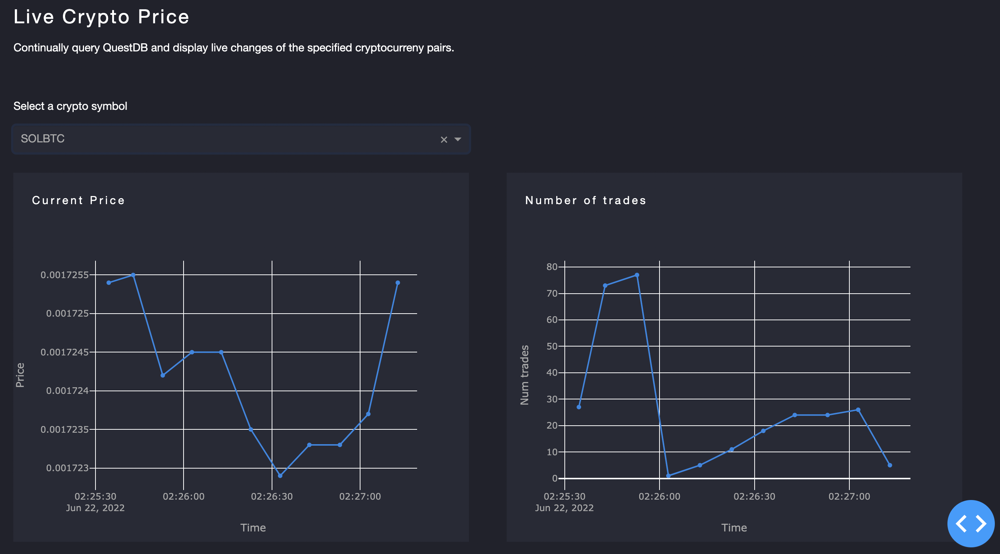

# Real-time Crypto price dashboard

Simple dashboard powered by real-time streaming of cryptocurrency prices into QuestDB and Plotly/Dash.

This dashboard displays cryptocurrency prices of select tokens as well as the number of trades, which is updated in real-time. Data is grabbed
continuously from the Binance API, using tasks setup with Celery and Redis. The data is then visualized using Plotly and Dash.

Two graphs are displayed : one for price and one for the number of trades. The initial screen shows all of the token data at once, and users are able to view a single token's data by selecting it in the drop down.

## Setup
- Update .env file
  - Obtain API key/Secret through Binance account and add into .env
  - Update list of desired ticker symbols in `SMD_SYMBOLS`
  - example .env file: 
   `SMD_API_KEY = "xxx"
    SMD_API_SECRET = "xxx"
    SMD_FREQUENCY = 10
    SMD_SYMBOLS = ["BNBBTC","SOLBTC","ETHBTC"]`
- Run `pip install requirements`
- Activate docker via `docker-compose up`
- Open a new terminal and start populating the DB via: `python -m celery --app app.worker.celery_app worker --beat -l info -c 1`
  - view here: http://127.0.0.1:9000
  - *** May need to create the table in QuestDB (copy+paste `create_table.sql` query into QuestDB)
- Start the dashboard via: `PYTHONPATH=. python app/main.py`
  - view here: http://127.0.0.1:8050/

 ## Main Components
Backend:
- Utilizes Docker for Redis & QuestDB
- Triggers Celery workers to use a Redis broker and retrieve data from the Binance API
- Stores the data into QuestDB

Frontend:
- Grabs data from QuestDB and visualizes via Plotly and Dash

Inspiration from: https://hackernoon.com/build-a-real-time-stock-price-dashboard-with-python-questdb-and-plotly

### Tools
- Binance API client
- Docker
- Redis
- QuestDB
- Celery
- Plotly
- Dash

